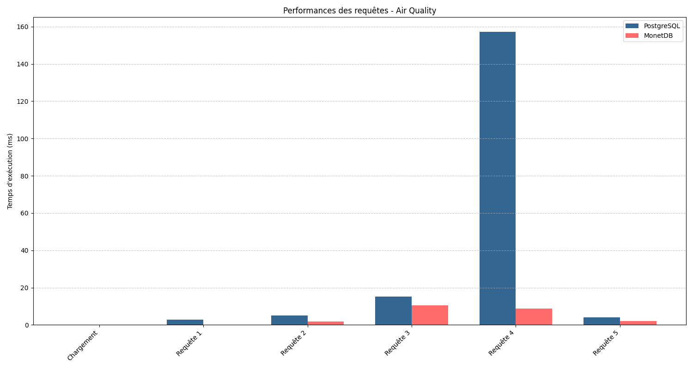
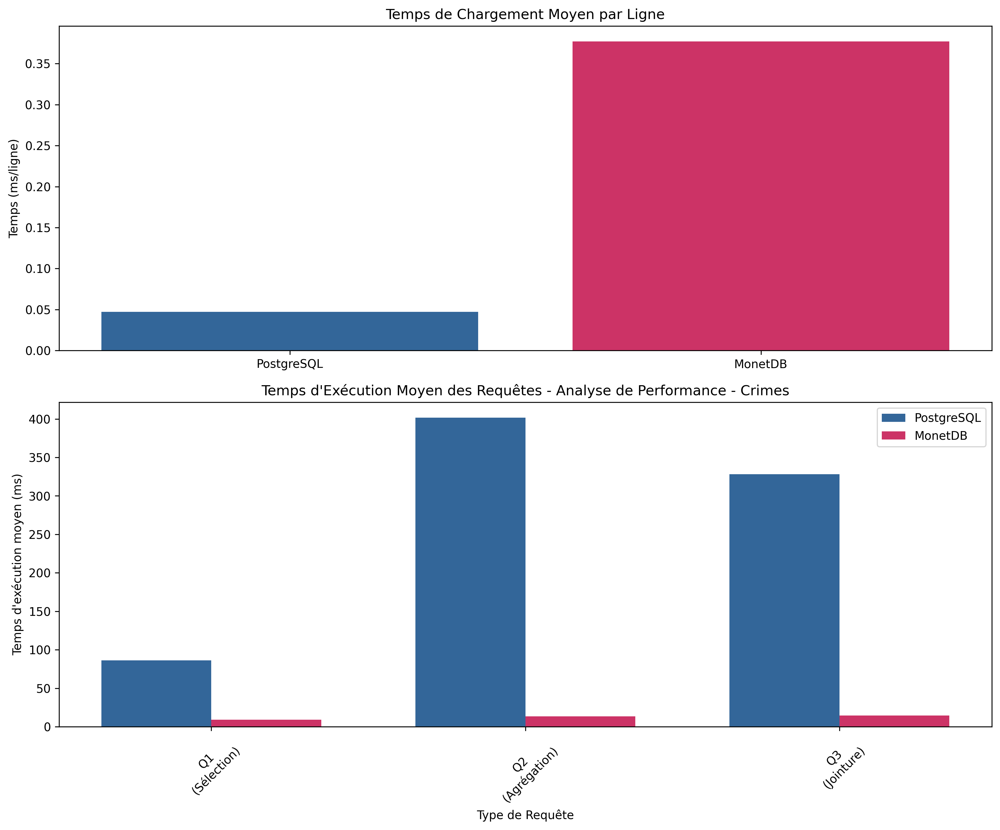

# 📊 Database Analyzer

## 📋 Table des matières

1. [Introduction](#-introduction)
2. [Auteurs](#-auteurs)
3. [Objectifs](#-objectifs-du-projet)
4. [Installation](#-installation)
   - [Prérequis système](#prérequis-système)
   - [Installation du projet](#installation-du-projet)
   - [Installation des données](#installation-des-données)
   - [Lancement de l'analyse](#lancement-de-lanalyse)
5. [Structure du projet](#-structure-du-projet)
6. [Fonctionnalités](#-fonctionnalités)
   - [Configuration automatique](#configuration-automatique)
   - [Analyse des performances](#analyse-des-performances)
   - [Visualisation](#visualisation)
7. [Résultats](#-résultats)
8. [Explication des différences de performance ](#-explication-des-différences-de-performance)
9. [Licence](#-licence)

## 📝 Introduction

Ce projet d'analyse comparative de bases de données a été développé dans le cadre de l'UE "Bases de Données" du Master Ingénierie Logicielle à l'Université de Rennes. Il permet d'évaluer et de comparer les performances de PostgreSQL et MonetDB sur différents types de requêtes et scénarios d'utilisation.

L'outil propose une suite complète de tests automatisés, générant des visualisations détaillées et des métriques précises pour faciliter la comparaison des performances entre ces deux SGBD.

### 🌟 Points forts

- Analyse comparative approfondie
- Installation automatisée via Docker
- Visualisations graphiques détaillées
- Tests sur différents types de requêtes
- Documentation complète

## 👥 Auteurs

- **Grégoire BODIN** - Master 1 IL
- **Léo BERNARD-BORDIER** - Master 1 IL

## 🎯 Objectifs du Projet

Ce projet vise à :

- Comparer les performances de PostgreSQL et MonetDB
- Analyser l'impact des différentes stratégies d'indexation
- Évaluer les performances sur différents types de requêtes :
  - Requêtes de sélection simple
  - Jointures complexes
  - Agrégations
- Fournir des visualisations claires et détaillées des résultats

## 🔍 Rapport

Vous pouvez consulter le rapport complet [ici](raport/main.pdf).

## 🚀 Installation

### Prérequis système

- Git
- Docker et Docker Compose
- 4 Go de RAM minimum
- 2 Go d'espace disque disponible

### Installation du projet

1. **Cloner le repository**

   ```bash
   git clone git@github.com:GregoireBDN/Database-Analyzer.git
   cd Database-Analyzer
   ```

2. **Configurer l'environnement**
   ```bash
   cp .env.example .env
   # Modifier les variables dans .env si nécessaire
   ```

### Installation des données

En raison de leur taille, les fichiers de données doivent être téléchargés séparément :

#### Sources des données

- **Air Quality Data** : [NYC Open Data - Air Quality](https://catalog.data.gov/dataset/air-quality)

  - Description : Données de surveillance de la qualité de l'air à New York
  - Format : CSV
  - Placer dans : `data/air_quality.csv`

- **Crime Data** : [LA City - Crime Data 2020 to Present](https://catalog.data.gov/dataset/crime-data-from-2020-to-present)
  - Description : Données sur la criminalité à Los Angeles depuis 2020
  - Format : CSV
  - Placer dans : `data/crimes.csv`

#### Préparation des données

1. Créer le dossier `data` :
   ```bash
   mkdir -p data
   ```
2. Télécharger et placer les fichiers CSV dans `data/`
3. Vérifier les noms des fichiers :
   - `data/air_quality.csv`
   - `data/crimes.csv`

### Lancement de l'analyse

Une fois les données installées :

```bash
chmod +x run.sh
./run.sh
```

## 📁 Structure du projet

```
Database-Analyzer/
├── docker/                 # Configurations Docker
│   ├── python/
│   │   ├── Dockerfile
│   │   └── requirements.txt
│   ├── postgres/
│   │   └── Dockerfile
│   └── monetdb/
│       ├── Dockerfile
│       └── scripts/
│           └── start-monetdb.sh
├── scripts/               # Scripts utilitaires
│   └── init.sh           # Script principal
├── src/                  # Code source Python
│   ├── database/        # Connecteurs, loaders et analyseurs
│   ├── queries/         # Requêtes SQL
│   ├── visualization/   # Génération des graphiques
│   ├── __init__.py
│   └── main.py         # Point d'entrée
├── data/                # Données d'analyse
│   ├── air_quality.csv
│   └── crime.csv
├── results/            # Graphiques générés
├── raport/             # Rapport de projet en LaTeX
│   ├── main.tex        # Fichier principal du rapport
│   └── main.pdf        # Rapport compilé
├── run.sh              # Script de lancement
├── setup.py           # Configuration du package
├── docker-compose.yml # Configuration des services
├── .env.example       # Template des variables d'environnement
└── README.md         # Documentation
```

## 🔍 Fonctionnalités

- **Configuration automatique**

  - Installation des SGBD
  - Création des bases de données
  - Configuration des utilisateurs et permissions

- **Analyse des performances**

  - Temps d'exécution des requêtes
  - Utilisation des ressources
  - Lecture/écriture disque
  - Impact des index

- **Visualisation**
  - Graphiques comparatifs
  - Statistiques détaillées
  - Export des résultats

## 📊 Résultats

Les résultats de l'analyse sont générés dans le dossier `results/` et incluent :

- Graphiques de comparaison des temps d'exécution
- Rapports détaillés par type de requête

## 🛠 Aperçu des Résultats

### Analyse de la Qualité de l'Air



Les résultats montrent que :

- PostgreSQL est plus efficace pour le chargement initial (0.03 ms/ligne vs 0.22 ms/ligne pour MonetDB)
- Les requêtes de sélection (Q1) et d'agrégation (Q2) sont similaires en performance
- MonetDB montre des performances inférieures sur les jointures complexes (Q3) avec un temps d'exécution ~7x plus élevé

### Analyse des Crimes



Points clés :

- MonetDB montre un temps de chargement plus élevé (0.37 ms/ligne vs 0.05 ms/ligne pour PostgreSQL)
- PostgreSQL présente des temps d'exécution significativement plus élevés pour :
  - Les sélections (Q1) : ~100ms vs ~15ms pour MonetDB
  - Les agrégations (Q2) : ~400ms vs ~15ms pour MonetDB
  - Les jointures (Q3) : ~325ms vs ~20ms pour MonetDB
- MonetDB maintient des performances constantes sur tous les types de requêtes

### Conclusions

1. **Chargement des données** :

   - PostgreSQL est plus efficace pour le chargement initial des données
   - MonetDB montre des temps de chargement 7-8x plus élevés

2. **Exécution des requêtes** :

   - PostgreSQL performe mieux sur des requêtes de jointure sur un faible volume de données

   - MonetDB excelle sur l'ensemble des requêtes avec des volumes de données plus importants

## 📝 Explication des différences de performance

### 1. Chargement des données

PostgreSQL est plus rapide au chargement initial car :

- Il utilise une architecture orientée ligne (row-oriented)
- Les données sont directement écrites dans le format de stockage final
- Optimisé pour les insertions ligne par ligne

MonetDB est plus lent au chargement car :

- Il utilise une architecture orientée colonne (column-oriented)
- Les données doivent être réorganisées par colonne lors du chargement
- Nécessite plus d'opérations de transformation des données

### 2. Exécution des requêtes

#### Sur petit volume de données

PostgreSQL performe mieux car :

**Architecture row-oriented optimisée**

- Les données d'une même ligne sont stockées de manière contiguë
- Accès rapide à toutes les colonnes d'une ligne en une seule lecture disque
- Idéal pour les requêtes OLTP qui accèdent à plusieurs colonnes d'une même ligne

**Gestion efficace des index**

- Index B-tree optimisés pour les petits volumes
- Maintenance des index moins coûteuse
- Statistiques précises pour l'optimiseur de requêtes
- Mise à jour rapide des index lors des modifications

**Utilisation optimale du cache**

- Les données fréquemment accédées restent en cache
- Buffer pool bien dimensionné pour petits volumes
- Prédiction de lecture efficace
- Moins de défauts de cache (cache misses)

#### Sur grand volume de données

MonetDB devient plus performant grâce à :

**Architecture column-oriented optimisée**

- Stockage par colonne permettant :
  - Lecture sélective des colonnes nécessaires
  - Réduction drastique des I/O disque
  - Meilleure utilisation de la bande passante

**Compression avancée des données**

- Compression par colonne plus efficace
- Algorithmes spécialisés par type de données
- Décompression à la volée optimisée
- Réduction significative de l'empreinte mémoire

**Optimisations OLAP**

- Matérialisation tardive des résultats
- Parallélisation automatique des requêtes
- Optimisations spécifiques aux agrégations
- Gestion efficace des jointures sur grandes tables

**Vectorisation et parallélisation**

- Instructions CPU vectorielles (SIMD)
- Traitement parallèle des colonnes
- Pipeline d'exécution optimisé
- Utilisation maximale des cœurs CPU

### 3. Impact du type d'architecture

#### PostgreSQL (Row-oriented)

✅ **Avantages**

- Transactions OLTP performantes
  - Verrouillage fin au niveau ligne
  - ACID strict
  - Commit/Rollback rapides
- Efficace sur petits volumes
  - Cache hit ratio élevé
  - Peu de fragmentation
  - Index compacts
- Mise à jour rapide
  - Une seule écriture par modification
  - Journalisation optimisée
  - Moins de fragmentation

❌ **Inconvénients**

- Lecture de données inutiles
  - Charge I/O plus importante
  - Gaspillage de bande passante
  - Cache pollué par données non utilisées
- Performances limitées sur gros volumes
  - Scalabilité verticale principalement
  - Compression moins efficace
  - Plus de mouvements de données

#### MonetDB (Column-oriented)

✅ **Avantages**

- Analyses OLAP optimisées
  - Agrégations rapides
  - Jointures efficaces sur grandes tables
  - Parallélisation naturelle
- Compression efficace
  - Ratio de compression élevé
  - Moins d'I/O disque
  - Meilleure utilisation mémoire
- Évolutivité
  - Scalabilité horizontale native
  - Parallélisation automatique
  - Vectorisation CPU

❌ **Inconvénients**

- Chargement initial lent
  - Réorganisation des données
  - Construction des index
  - Compression des colonnes
- Transactions complexes
  - Verrouillage plus grossier
  - Overhead de reconstruction
  - Latence plus élevée

## 📝 Licence

Ce projet a été développé dans un cadre universitaire à l'Université de Rennes.
